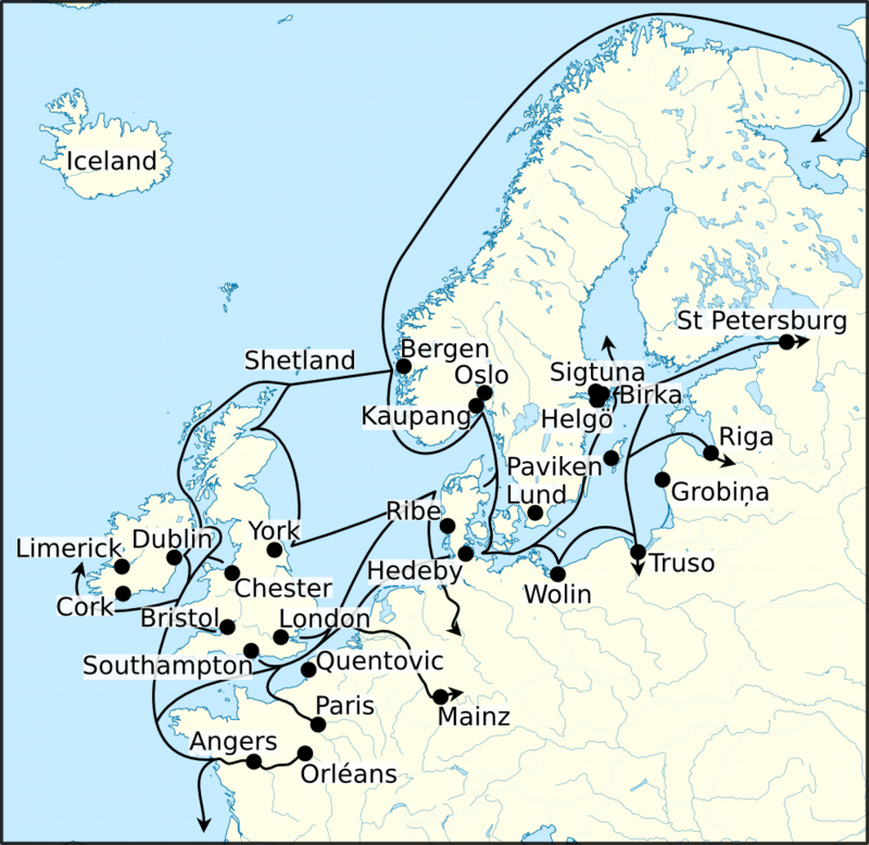

IDPA Nordmänner

[]{#anchor}Einleitung / Fragestellung
=====================================

Diese Arbeit beschäftige sich mit der Mythologie der Nordmänner und in
welchem Kontext diese zu der Lebensart, Politik, der Rechtsprechung, den
Handel und den Krieg steht. Da sich die Ära der Germanen und Nordmänner
über mehr als 2000 Jahre erstreckt, wird in dieser Arbeit vor allem der
Zeitraum der Wikinger, also das 8. bis 13. Jahrhundert betrachtet. Die
Menschen zu dieser Zeit mussten in der Lage sein mit der Natur zu
überleben. Genau diese Natur welche sich so wunderschön aber brutal und
gnadenlos zeigt. So wird auch die Mythologie der Nordmänner beschrieben.
Wir möchten mit dieser Arbeit erarbeiten und welchen Bereichen des
Lebens diese Mythologie Einzug gehalten hat um so die Lebensweise
unserer Vorfahren besser zu verstehen.

# Methodik

# []{#anchor}Mythologie

Im folgenden Kapitel wird die Mythologie der Nordmänner behandelt. Das
Kapitel soll eine Übersicht bieten. Dieses Thema ist aber so komplex das
nicht auf jedes Detail eingegangen wird. In den Quellenangaben und dem
Anhang wird auf Texte und weitere Informationen verwiesen, welche für
das Thema relevant sind.

## []{#anchor}Die Eddas

Die beiden Eddas stellen die aktuellste Quelle für die Mythologie der
Nordmänner dar. Sie unterscheiden sich aber gravierend voneinander,
wobei beide Werke um das 13 Jahrhundert entstanden sind.

Die Liederedda oder auch ältere Edda ist eine Sammlung von Lieder und
Versen welche die Mythen beschreiben. Alle Texte in der Liederedda sind
in der Skaldischen Dichtkunst verfasst.

> "Skaldische Dichtungen sind subjektiv gestaltete Kompositionen, die ihre
> Stoffe dem Leben und dem sozialen Umfeld ihres Dichters, des Skalden,
> entnehmen: sie sind situationsgebundene Gesellschaftsdichtung" 
> [https://de.wikipedia.org/wiki/Skaldisch Stand 25.12.2018]

Das zweite Buch die Edda des Snorri Sturluson, auch Snorris Edda
genannt, ist ein Zusammenfassung der vieler einzelner Geschichten aus
der Sagenwelt der Nordmänner. Auch die Skaldische Dichtkunst wird
erklärt und mit vielen Beispielen illustriert.

Der Verfasser Snorri Sturluson war ein christlicher Mönch der in Island
um das 13te Jahrhundert gelebt hat. Zu dieser Zeit fand die
Christianisierung von Europa statt. Snorris Anliegen mit seiner Edda war
es die skaldische Dichtkunst mit ihren Geschichten zu erhalten.

## Sagas

Eine weitere jedoch viel kleinere Quelle sind die nordischen Legenden, auch Sagas gennant.
Die Sagen sind in acht Kategorien unterteilt. Die König Sagas(Konungasögur), die Sagen der Icelander(Íslendinga sögur),
die Kurzgeschichten der Isländer(Íslendingaþættir), die zeitgenösischen Sagas(Samtíðarsögur), die lengendären Sagas(Fornaldarsögur),
die Rittersagen(Riddarasögur), die heiligen Sagen(Heilagra manna sögur) und zuletzt die Sagen der Bischöfe(Biskupa sögur).
Auf all diese Sagen können natürlich nicht im Detail eingegangen werden. Aber die Sakdinavische und die Isländische Kultur haben eine
reiche Tradition des Geschichten erzählens. Dies dürfte damit zusammenhängen, dass das Wissen der Nordmänner mündlich überliefert worden ist.
Sie haben es jedoch verstanden, dieses Wissen über Ereignisse grosse Könige oder auch das Wissen ihrer Götter, in spannende Geschichten
zu verpacken welche dann über Generationen weitererzählt werden. 

## []{#anchor}Yggdrasil und die neun Welten

> "Eine Esche kenn ich - überschütte-, sie heisst Yggdrasil, ein hoher
> heiliger Baum - mit weissem Sand; von dort kommt der Tau, der in den
> Tälern niederfällt; sie steht immer grün über dem Urdbrunnen"
> [Die Götterlieder der Älteren Edda, Die Weissagung der Seherin Vr.19]

Die Esche Yggdrasill stellt in der nordischen Mythologie das Leben und
das grosse allumfassende Ganze dar. Alle neun Welten sind durch
Yggdrasil miteinander verbunden. Es bestehen verschiedene
Interpretationen wo genau sich die Welten im Weltenbaum befinden. Einig
sind sie sich jedoch, dass sich Midgard im Zentrum und Asgard in der
Krone des Baumes befinden.

## []{#anchor}Asen

Die Asen, auch bekannt als Himmelsgötter, ist die Götterfamilie über die
am meisten überliefert ist. Fast alle Geschichten in beiden Eddas
handeln von den Himmelsgötter. Sie leben in der Welt von Asgard. Jede
der Gottheiten besitzt in dort einen eigenen Ort oder eine Halle, wobei
nicht bei jeder Gottheit überliefert ist, wie der Ort genannt wird, oder
wie dieser aussieht.

Im folgenden werden die wichtigsten Götter und Göttinnen und deren
Aspekte aufgeführt.

### []{#anchor}Odin / Wotan

Odin der Göttervater oder auch Allfather gennant, ist einer der
komplexesten Götter der Mythologie. Viele Aspekte werden unter ihm
vereint. Unter anderem: Krieg, der Tod, Weisheit und das streben nach
Wissen.

Die Quelle Mimirs enthält das Wissen und die Weisheit nachder Odin
strebt. Odin hat sein linkes Auge geopfert um von dieser Quelle trinken
zu können. Auch wird erzählt das er neun Tage an der Esche Yggdrasill
hing um so das Wissen der Runen zu erlangen.

> Ich(Odin) weiss, das ich hing am windigen Baum(Yggdrasil) neun ganze
> Nächte, vom Speer verwundet und Odin geopfert, selber mir selbst, an dem
> Baum, von dem niemand weiss, aus welcher Wurzel er wächst 
> [Die Götterlieder der Älteren Edda, Die Sprüche des Hohen Vr. 138]

Ein weiterer Aspekt von Odin ist der des Kriegs-und Totengottes. Nach
jeder Schlacht wählen die Valküren aus den gefallenen Kriegern die
Hälfte aus. Diese werden nach Valhalla gebracht. Dort werden sie sich
jeden Morgen gegenseitig bekämpfen. Um anschliessend von Odin
wiederbelebt zu werden um anschliessend gemeinsam in der goldenen Halle
zu feiern. Die gefallenen Krieger werden in den Eddas Einherjer genannt.

Der Mittwoch wurde Odin gewidmet. Dies ist in der deutschen Sprache
verlorengegangen, ist aber noch im englischen Wochentag
Wendesday(Wodendag) ersichtlich.

### []{#anchor}Frigga

> [...] "Frigg ist die vornehmste. Sie besitzt den Hof,
> der Fensalir heisst und besonders prächtig ist[...]" 
> [Die Edda des Snorri Sturluson, Gylfis Täuschung Vr.35 ]

Frigga oder auch Frigg ist die Frau von Odin und eine Heilerin. Sie ist
die Göttin des Haushaltes, der Kinder. Als eine der wenigen
Götterfiguren, ist sie in der Lage in die Zukunft zu sehen. Jedoch
spricht sie nie über das was sie sieht.

Es wird darüber debattiert ob Freya, die Göttin der Liebe und
Fruchtbarkeit(Siehe im Kapitel Vanen) und Frigga den gleichen Ursprung
haben. Sich also eine Götterfigur in zwei abgespalten haben.

> Nach einer verbreiteten Hypothese entwickelte sich aus Frigg, für die
> auch der Beiname Hulla („Huldvolle") bezeugt ist, die Märchengestalt der
> Frau Holle. [https://de.wikipedia.org/wiki/Frigg Stand 02.12.2018\]

### []{#anchor}Thor / Donnar

> "Nennen werde ich meinen Namen, auch wenn ich geächtet wär,
> und mein ganzes Geschlecht: Ich bin Odins Sohn, Melis Bruder und Magnis Vater,
> Der Kraftherr der Götter; mit Thor kannst du hier sprechen.
> Das will ich jetzt fragen, wie du heisst"
> [ Die Götterlieder der Älteren Edda, das Harbardlied, Vr.9]

Der Sohn von Odin und Gia(die Göttin der Erde über die wenig bekannt
ist) ist Thor. Er ist der stärkste der Asen und sehr kampferprobt. Er
kämpft stetig gegen die Riesen, welche Asgard und Midgard bedrohen. In
den Kampf zieht er oft mit seinem Streitwagen, der von seinen zwei
Böcken, Tanngnjost und Tanngrisnir, gezogen wird. Auch die Aspekte von
Kameradschaft und Gastfreundschaft werden durch Thor vertreten. Thor
besitzt drei Gegenstände. Der Kraftgurt, welcher die Kraft von ihm um
das doppelte erhöht. Ein eiserner Handschuh, welcher er benötigt um
seine Waffe besser führen und seinen mächtigen Hammer Mjöllnir. Mjöllnir
kehrt immer zu seinem Besitzer zurück und es werden ihm heilende
Kräfte zugeschrieben. Bis heute ist Mjöllnir ein Schutzsymbol für
heidnische Menschen.

> Aber bei meiner Halle hast du einen Berg gesehen, darin waren drei
> viereckige Täler, und eines war besonders tief; Das waren die Spuren
> deiner Hammerschläge. [ Die Edda des Snorri Sturluson, Gylfis Täuschung
> Vr. 47]

In der Liederedda wird immer wieder vermerkt, dass Thor eher ein Gott
für das einfache Volk war. Wobei diese These umstritten ist da Odin oft
in den Geschichten mit Thor aneinandergerät.

> "Ich (Odin verkleidet als Harbard) war in Walland und suchte Kämpfe, ich
> hetzte Fürsten auf, aber versöhnte sie nie; Odin hat die Jarle, in der
> in der Schlacht fallen, aber Thor hat das Geschlecht der Knechte"
> [Die Götterlieder der Älteren Edda, Das Harbardlied V.24]

Ebenfalls ist Thor auch der Namensgeber des Donnerstags oder Thursday.

### []{#anchor}Loki

> "Zu den Asen wird auch derjenige gezählt, den manche 
> Verleumder der Asen, Urheber der Hinterlist und 
> Schande der Götter und Menschen nennen"
> [Die Edda des Snorri Sturluson, Gylfis Täuschung Vr.33]

Loki ist neben Odin einer der komplexesten Charaktere der Mythologie. Es ist nicht klar wer seine Eltern sind,
jedoch kann davon ausgegangen werden das Odin sein Vater ist. Er
wird oft als böser Scharlatan und Missetäter beschrieben. Er arbeitet
oft gegen die Götter, aber genau so oft auch für sie. Da Loki hat die Macht seine Form zu wandeln.
Loki wird derjenige sein welcher das Ragnarök einleutet und kämpft am Ende gegen
die Asen. Bei genauerer Betrachtung jedoch erscheint Loki nicht nur als
böser hinterlistiger Charakter. Den nur durch eine List von Loki bei den
Zwergen, erhielt Thor seinen Hammer, Odin seinen Speer und alle anderen
magischen Gegenstände der Götter. Ebenfalls war Loki, der es wieder mit
einer List möglich machte, dass Thor seinen Hammer zurück bekam, nachdem
dieser von einem Riesen gestohlen wurde(siehe Thrymlied in "Die
Götterlieder der Älteren Edda). Viele Interpretationen gehen davon aus,
dass Loki für den Aspekt des Gleichgewichts steht. Jedes Licht wirft
einen Schatten, nach diesem Schema scheint Loki zu agieren. Auch
Elterliche Aspekte werden ihm zugesprochen. Da er so viele verschiedene
Kinder gebar. Einer seiner grössten Auftritte erhält Loki in Die
Götterlieder der Älteren Edda im Lied: *Lokis Spottrede* oder im
Original *Lokasenna* genannt. In diesem Lied rechnet Loki mit den Asen,
welche ein Fest feiern, ab indem er alle beleidigt und den Götter ihre
Schwächen und Fehler aufzeigt.

### []{#anchor}Die Kinder Lokis

Lokis Kinder sind wichtig zu erwähnen da sie das Gegengewicht zu des Asen darstellen.
Drei Kinder gebar die Risin Angrboda Loki. Die Midgardschlange
Jörmungandr, der grosse Wolf Fenrir und die Göttin des Todes und des
Verfalls Hella. Jörmungandr ist so gross das er ganz Midgard umschliesst
und sich selber in den Schwanz beisst. Fenrir wurde aufgrund der
Prophezeiung des Ragnaröks von den Götter gefangen genommen. Das
wichtigste Kind ist mit Sicherheit Hella. Sie wurde von Odin den
Herrscherplatz über Helheim, die Welt der Toten zugewisen und macht sie
so zur Göttin des Todes und des Verfalls. Hella eher als grimmig bekannt
besteht aus zwei menschlichen Körperhälften. Eine Seite in der alles
lebt und gesund ist, die andere Seite besteht aus totem fauligen
Fleisch. Alle die an Krankheit oder Altersschwäche sterben, gehen nach
Helheim. Dies gilt ebenso für Ehrenlose oder Kriminelle. Diese Toten
werden am Ragnarök an Lokis Seite kämpfen. Über Hella sind nicht viele
Geschichten, mit der Ausnahme von Baldrs Tod, überliefert. Aber sie ist
fester Bestandteil des zyklischen Weltbildes der Nordmänner. Auch das
achtbeinige Pferd Odins ist einer von Lokis Kindern. Dieses Pferd ist
durch eine List entstanden. Die Geschichte dieser List kann in der Edda
des Snorri Sturluson Gylfis Täuschung Vers 42 nachgelesen werden.

### []{#anchor}Tyr

> Der Gott Tyr der in der allemanischen Sprache auch Tiwaz gennant wird
> ist der kühnste aller Asen. Ebenfalls ist der der Namensgeber des
> Diestags [https://de.wikipedia.org/wiki/Tyr Stand 25.12.2018]

Er über den Ausgang einer Schlacht. Daher wurde Tyr oft vor dem Kampf
angerufen. Bei der Gefangennahme des Wolfs Fenrir (siehe im Kapitel Loki
und seine Kinder) spielt er eine Schlüsselrolle dar(siehe in Die Edda
des Snorri Sturluson Gylfis Täuschung Vr 25) Tyr ist ebenfalls der
Souverän des Rechts und deshalb geht man davon aus, dass er bei Things
oder Gerichten angerufen wurde. Viel mehr ist über diesen Asen leider
nicht überliefert. Gewisse Forscher gehen davon aus das Tyr vor 2000
Jahren während der Zeit der Römer einen viel grösseren Stellenwert hatte
und von der Gottheit Odin im Lauf der Zeit verdrängt wurde.

### []{#anchor}Balder

> Ich sah Balder, den blutenden Gitt,
> Odins Kind, das Schicksal bestimmt;
> gewachsen war, über den Feld hoch,
> schmall und sehr schön, der Mistelzeig
> [Die Götterlieder der Älteren Edda, Die Weissagung der Seherin Vr.31]

Der Sonnengott Balder ist der schönste und strahlenste der Asen. Über
ihn gäbe es nichts Schlechtes zu erzählen. Er ist der redegewandteste
und huldvollste Gott. Jedoch, so schreibt Snorri, haben seinen
Entscheidungen keinen Bestand. Der Mythos von Balders Tod spielt eine
grosse Rolle in der Mythologie und wird ebenfalls mit den Sonnenwenden
in Verbindung gebracht.

### []{#anchor}Der Tod Balders

Die Geschichte über den Tod Balders ist nicht im Detail in der
Liederedda beschrieben, jedoch in der Edda des Snorri
Sturluson Gylfis Täuschung Vr. 49 nachzulesen.

Der Tod von Balder stellt die Sonnenwenden dar. Im grössten Glanz der
Sonne stirbt sie. Die Tage werden kürzer während Balder nach Hel reist.
Dann im Winter wenn die ganze Natur stirbt und so der Kreislauf zuende
geht, erstrahlt die Sonne zu neuem Glanz. Dann nach der
Wintersonnenwende werden die Tage wieder länger und die Natur erwacht
langsam wieder. Über Balder als Charakter ist aus der Mythologie nicht
sehr viel bekannt. Aber die Geschichte über Balders Tod widerspiegelt
die zyklische Weltanschauung der damaligen Menschen.

### []{#anchor}Heimdall

Der Gott der den Bifröst, die Regenbogenbrücke welche Midgard und Asgard
miteinander verbindet bewacht, heisst Heimdall. Er ist der weisseste der
Asen und wird auch als Wächter der Götter bezeichnet. Auch besitzt
Heimdall das grosse Kriegshorn Gjallarhorn dessen Laut man über alle der
neun Welten hören kann.

Das Lied *Merkgedicht von Rig* in der Liederedda, beschreibt Heimdall
auch als Schöpfer der Mittelalterlichen Ständen: Knecht, Bauer, Jarl
bzw. König.

## []{#anchor}Vanen

Die Vanen werden oft als Erdgötter oder als Naturgeister beschrieben.
Sie stellen ein weiteres Göttergeschlecht dar. Ihre Welt wird Vanheim
gennant. Leider ist über die Vanen bei weiten nicht so viel überliefert
als es bei den Asen der Fall ist.

### []{#anchor}Der Krieg mit den Asen

Dieser Krieg stellt laut Snorri den ersten Krieg zwischen den
Göttergeschlechter. Nachdem er zu Ende ging wurden Geiseln zwischen den
Familien ausgetauscht. Die Vanen stellten Njörd die Asen tauschten Hönir
ein.

### []{#anchor}Njörd

Die Geisel der Vanen an die Asen regelt den Verlauf des Windes, des
Meeres und des Feuers. Njörd war mit der Riesin Skadi verheiratet. Die
Kinder aus dieser Ehe sind Freyja und Freyr.

### []{#anchor}Freyr

Freyr wurde als Fruchtbarkeitsgott verehrt. Er wacht über den Regen, den
Sonnenschein und das Wachstum der Pflanzen. Ebenfalls regelt er den
Reichtum der Menschen.

### []{#anchor}Freyja

Freyja nimmt den Platz als Göttin der Liebe und der Ehe ein. Sie ist als
einige der wenigen Götter der Zauberkunde mächtig. Ihr werden aber auch
sehr aggressive Züge zugeschrieben. Sie ist die Königin der Walküre und
reiten auf ihrem Streitwagen, welcher von Wildkatzen gezogen wird, in
die Schlacht. Ihr steht die zweite Hälfte der Gefallenen Kriegern zu(
Odin erhält die erste Hälfte).

## []{#anchor}Jotun

Die Riesen leben in Jotenheim und werden daher Jotun genant. Die Risen
werden niemals als Götter dargestellt obwohl sie sich kräftemässig
ebenbürtig sind. Die Jotun werden als die chaotische, oft auch sehr
zerstörerische Seite der Natur dargestellt. Diese These wird gestürzt
durch die Erzählung von Thor. Thor der immer für die Menschen gegen die
Riesen kämpft. Um so das Gleichgewichts. In den Eddas werden immer
wieder Namen von verschiedenen Riesen genannt es ist aber mal abgesehen
vom Namen in der Regel nicht viel mehr überliefert.

## []{#anchor} Ragnarök

Das Ragnarök stellt das eine eines Zyklus dar. In der Mythologie wird das Ragnarök 
als apokalytischer Kampf dargestellt in dem Midgard verzehrt und viele Götter sterben werden.
Nach diesem Kampf aber ergrünnt die Welt wieder und die Kinder der Götter und Balder führen das Werk 
der Götter weiter bis auch deren Lebenszyklus endet. Der Zusammenhang zwischen Balders Tod und dem Ragnarök führt zur
Erkenntnis das jedes Jahr das Ragnarök stattfindet. Wen der Sonnengot stirbt sinkt der Sonnenstand. Die Natur stirbt und ebenso das
Leben. Erst nachdem die dunkle Zeit vorüber ist und der Frühling kommt kehrt wieder das Leben zurück.

# Sozialstruktur

### Literarische Quellen
Die Nordmänner besassen eine eigene Sprache und Schrift, diese bestand allerdings aus Runen. Es wurde nicht viel geschrieben und die wenigen Dokumente, die man finden konnte sind eher kurz. 
Am meisten Quellen wurden von Personen erstellt, die negativ von den Vikingern betroffen waren, diese sind meistens in Latein geschrieben. 
Skandinavische Werke tauchten erst im 11ten und 12ten Jahrhundert vermehrt mit der Christianisierung zusammen auf. Zu dieser Zeit gewann lateinisch auch an Bedeutung in dieser Region. 
Daher findet man erst aus dieser Zeit viele Schriftstücke. 

Bild zu den Schriftzeichen der Nordmänner.
Nur zwischen 9. und 11ten Jahrhundert verwendet.
[Quelle: https://en.wikipedia.org/wiki/Younger_Futhark]

### Gesellschaftliche Hierarchie

Im frühen Zeitalter der Wikinger hatten noch keine Könige existiert.
Wie länger wie mehr gewann das Königtum an Wichtigkeit. Das Einsetzen eines Königs zentralisierte die Macht über das ganze Volk bei ihm.  
Die Hierarchie der Nordmänner war in drei Hauptstufen unterteilt. 
Diese sind die Jarls(Aristokraten), die Karls(Mittel- und Unterschicht) und die Thralls, also Sklaven. 
Sklaverei war zur Zeit der Wikinger üblich und sicherlich auch ein Grund für die Überfälle in andere Länder. 
Auf den ersten Blick scheint dies eine sehr klare und abgegrenzte Struktur zu sein, jedoch war es möglich die Klasse zu wechseln. Sehr reiche Jarls konnten zu Königen aufsteigen. Wenn jemand der Unterschicht zu fest in Schulden geriet, musste er zwangshalber seine Schulden als Sklave abarbeiten und Sklaven hatten sogar die Möglichkeit in ihrer Freizeit Waren zu produzieren, diese zu verkaufen und sich mit diesem Geld selber frei zu kaufen. Ansonsten fehlten den Sklaven jedoch jegliche Rechte und häufig mussten sie sterben, sobald sie nicht mehr arbeiten konnten. 

### Familienleben

Im Zeitalter der Wikinger lebten die meisten Menschen auf Bauernhöfen. Häufig sind mehrere Familien zusammen im gleichen Haushalt gewesen. Die übliche Grösse eines solchen Haushalts betrug zwischen 10 und 20 Menschen. Auf einer Farm wurde alles gemacht was man sich so vorstellen kann. Es wurde Felder bewirtschaftet und man züchtete Hühner und Vieh. Die Bewohner eines Bauernhofes hielten sogar Haustiere. 

Kinder mussten bereits sehr früh im Haushalt mitarbeiten. Es wurde von ihnen erwartet, dass sie ihren Teil zum Wohl der Gemeinschaft 
beitragen. Genau so lernten sie allerdings auch, wie sie die Arbeiten zu verrichten hatten, die sie später am Leben erhielten. 
Kinder mussten jedoch nicht nur arbeiten, sondern hatten auch Zeit zum spielen. Es wurden mehrere Spielzeuge in der Form von Puppen, 
kleinen Holzpferden und Schiffchen gefunden.  
Regelmässig wurden Kinder auch in respektable Leihfamilien weitergegeben. Das Ziel war das Kind von der Leihfamilie erziehen zu lassen. 
Ein Grund für solche Arrangements war ebenfalls, dass die Kindersterblichkeit extrem hoch war und somit einzelne Familien kaum Kinder 
hatten, während andere Paare kinderlos waren. Das Erziehen der Kinder wurde in der Regel auch monetarisch kompensiert.

Kinder wurden bereits zwischen dem 12ten und 16ten Lebensjahr erwachsen. Mit dem Erreichen dieses Alters mussten sie wissen, 
wie man einen Haushalt hielt und es wurde erwartet, dass sie eine eigene Familie aufbauen. Was sie allerdings nicht lernten ist 
das Lesen und Schreiben, was die heutige Arbeit für Historiker deutlich erschwert.

### Frauen und Männerbild

#### Rollenverteilung

Die Kultur wurde generell von Männern dominiert, jedoch besassen die Frauen je nach 
Stand auch viel Macht. Die Rolle der Frauen war, dass sie den Haushalt führten. Sie kümmerten sich um die Tiere, 
lagerten das Essen für den Winter ein, arbeiteten im Garten und kümmerten sich um die Familie. Die wichtigste ihrer 
Aufgaben war das Fabrizieren neuer Kleider. Männer halfen ebenfalls im Haushalt mit, übernahmen jedoch die körperlich 
strengeren Arbeiten. Sie vertraten ebenfalls die Familie in der Gemeinschaft und bildeten das Haupt einer Familie. 
Bekannterweise zogen Männer auch häufig in den Krieg, in diesen Zeiten mussten ihre Frauen den Haushalt übernehmen.

Ehen wurden von den Eltern arrangiert und Kinder wurden zwischen dem 12ten und 20ten Lebensjahr verheiratet. 
Das für uns junge Alter kam sicherlich auch davon, dass die Lebenserwartung zu dieser zeit höchstens 50 Jahre betrug. 
Bei der Verlobung bezahlte die Familie des Bräutigams der Familie der Braut einen Brautpreis. 
Bei der Hochzeit hingegen wurde die Mitgift vom Vater der Braut bereitgestellt. Somit haben beide Familien ein finanzielles 
Interesse an der Ehe der Kinder.

#### Polygamie / Monogamie

Zum Punkte der Polygamie gibt es vieles zu sagen. Das Problem ist allerdings, dass nur wenige Beweise dazu existieren. 
Das meiste was in diesem Absatz kommt ist also hauptsächlich Theorie aus verschiedenen Quellen.

Die Theorie existiert, dass die Kultur der Nordmänner früher eine Polygamie war. 
Man vermutet, dass die Oberschicht bedeutend attraktiver für Frauen waren und somit die Männer häufig 
mehrere Frauen haben konnten. Dies habe auch zu einem Frauendefizit geführt und habe entweder die Sklavenkultur 
bewirkt oder bedeutend verstärkt. In einzelnen Sagen wird jedoch auch von Frauen berichtet, die mehrere Männer überlebten. 

#### Homosexualität

Es existieren keine direkten Aufzeichnungen von gleichgeschlechtigen Päärchen zur Zeit der Wikinger. 
Die Idee einer ausschliesslich gleichgeschlechtigen Beziehung konnte man sich damals nicht vorstellen. 
Es war jedoch nicht wichtig wie das sexuelle Leben eines Menschen aussah, solange man sich an die Normen 
hielt und eine Familie und Kinder hatte. Von Menschen, die sich aus Beziehungen fern hielten, wurde gesagt sie haben 
Angst vor dem anderen Geschlecht. Dies ist insbesondere in der Kriegerkultur der Wikinger eine tiefe Beleidigung. 
Somit haben die Wikinger nicht aus Prinzip eine Abscheu gegenüber homosexuellen Aktivitäten gehabt.

#### Schieldmaiden

Es existieren nur wenige Aufzeichnungen von Frauen, die wie die Männer in den Krieg gezogen sind. 
Es gab jedoch Gemeinschaften von Schieldmaiden, also Frauen, die sich wie Männer kleideten, für den Krieg 
trainierten und dann auch in den Krieg zogen. Das meiste was man davon weiss stammt aus literarischen Werken und 
das Thema der Schieldmaiden hat die Kultur damals bewegt. 

### Gräber

Es war üblich den Toten Geschenke mit in den Tod zu geben. Das bedeutet Güter zu ihnen ins Grab zu legen 
oder mit ihnen zu verbrennen. Teilweise wurden die Toten nämlich auch kremiert. Diese Kremation fand üblicherweise in 
der Mitte eines Steinkreises statt. Die Anzahl der Gegenstände und ihr Wert entsprach dem was sie in ihrem Leben hatten.
Das bedeutet, dass Sklaven meisten mit nichts begraben oder verbrannt wurden, während Jarls Unmengen an Schmuck und Werkzeugen 
mit in den Tod nahmen. Männer wurden mit ihren Waffen und Werkzeugen begraben, was auch ihre soziale Rolle gut darstellt. 
Frauen hingegen wurden mit Haushaltsgegenständen, Nähzeug und Schmuck begraben.  
Die reichsten und stärksten Stämme konnten ihre Macht durch riesige Grabfelder ausdrücken. 

Bild eines Grabkreises

Quelle: 

Eine alternative Art der Beisetzung ist auch die Verwendung eines Bootes als Grab. 
Der Leichnam wurde mit seinen Geschenken und Schätzen ins Boot gelegt und auf seine Reise geschickt.
Da Boote extrem aufwendig in der Produktion sind ist dies die kostspieligste Art und wurde nur selten verwendet.

## Sitte - Sittenrecht

## Thrall - Knecht

Die Sklaven, die als Knechte auf den Höfen dienten, bildeten die unterste Schicht des damals geläufigen Kastensystems.
Was sie durften wurde von ihrem Herrn bestimmt, der volkommene Gewalt über sie hatte. 
Als Beispiel: Ein Thrall konnte von seinem Meister als Grabbeigabe bestimmt und mit dem Verstorbenen begraben werden.
Die Thrall setzten sich aus drei Gruppen zusammen. Gefangene aus Raubzügen, Kinder von weiblichen 
Thrall und ehemals freie Normänner, die sich aufgrund von Schulden oder Armut in Knechtschaft begaben.

## Karl - freie

Die Karl waren die freien Normänner. Sie konnten einen Bauernhof besitzen, auf Raubzüge gehen und durften am Thing 
teilnehmen wo sie über die Zukunft mitbestimmen konnten. 
Für die Karl galten neben den festgelegten Gesetzen auch viele ungeschriebene Regeln die den sozialen Umgang bestimmten. 

## Jarl & Herse - Adliger

Ein Jarl, vergleichbar mit einem Grafen und ein Herse, vergleichbar mit einem Herzog, 
standen auf der gleichen, der höchsten Kastenebene. Vom Rang her waren sie einem König ebenbürtig, 
auch wenn sie sich ihm unterstellten.
Während sich der Titel des Jarls im gesamten Skandinavischen Raum finden lässt, taucht der Herse nur an der Norwegischen Küste auf.

Jarl - Verwalter/Herrscher  Herse - wahrscheinlich eher Befehlshaber einer Armee

# Recht

Die Nordmänner kannten keine Polizei. Wurde jemandem Unrecht getan, 
musste er sich selbst zu seinem Recht verhelfen.
Falls er in der Lage war, konnte er den Verursacher des Unrechts direkt zu 
Wiedergutmachung auffordern. Normalerweise appelierte der Geschädigte an die 
Ehre des Verursachers den Schaden wiedergut zu machen. 
Der Verursacher hatte so die Option den Schaden mit 
Zahlungen (Nahrungsmittel, Gebrauchsgegenstände, Arbeitsleistungen, Geld) auszugleichen. 
Ansonsten blieb dem Geschädigten noch die Option seinen Konkurrenten beim nächsten Thing anzuklagen

## Gesetze

Bis ins 10. Jahrhundert gab es keine geschriebenen Gesetze. 
Die geltenden Gesetze wurden von einem sogenannten Rechtsprecher auswendig 
gelernt und jeweils bei den Things vorgetragen.

## Das Thing

Ein Thing ist eine regelmässig stattfindende mehrtägige Versammlung. 
Im Normalfall umfing das Thing nur die Bewohner eines einzelnen Dorfes. 
War jedoch ein Stamm auf verschiedene Dörfer verteilt oder rief ein König zum Thing wurde von der Sippe oder dem Dorf 
ein Abgesandter bestimmt, der die seinen vertrat. Angeblich dauerte das Thing drei Tage. Am ersten Tag betrank man sich 
und diskutierte über die wichtigsten Dinge. An den folgenden Tagen wurden, nachdem alle wieder nüchtern waren wurden Gesetze 
erlassen und gerichtet.
Während des gesamten Things galt der "Thingfriede" während dem Konflikte und Fehden nicht verfolgt werden durften.

Wurde nun der Schadensverursacher während eines Things angeklagt, 
meist handelte es sich dabei um ein Verbrechen, das in eine Blutfehde ausarten könnte (z. B. Mord) 
oder es sollte eine möglichst grosse Gemeinschaft erreicht werden (Rechtfertigung bei Ehrverletzung) 
berieten die Teilnehmer des Things (Ausschliesslich freie Männer. Frauen, Kinder und Sklaven waren nicht zugelassen.) 
darüber wer im Recht war und welche Bestrafung angemessen war. Das Thing verpflichtete den Verlierer im Normalfall 
ebenfalls zu Wiedergutmachung. Weigerte der sich war das Thing in der Lage den Verursacher entweder für die Familie des 
Geschädigten oder für den ganzen Stamm vogelfrei zu erklären. Der Verursacher war nun durch keine Rechte mehr geschützt, 
und konnte ungestraft beraubt oder umgebracht werden, bis seine Schuld bezahlt oder die Dauer des Bannes vorüber war.

## Holmgang

Bei einem Streit konnte man den Disput auch mit einem Duell, 
dem sogenannten holmgang, beigelegt werden. Der holmgang fand in einem 
eingegrenzten Bereich statt und dauerte je nach Situation bis einer der Konkurenten 
den Bereich verliess, bis zum ersten Blut oder bis zum Tod.

#### Sonstige Rechte

Männer hatten das Recht zu fast allem, wobei die einzige Ausnahme der Dienst für weibliche Götter ist. 
Frauen hingegen hatten bedeutend mehr Rechte als in den anderen Kulturen, sie waren so gut wie gleich gestellt zu den Männern.
Die Männer hatten das Sagen im Haus, Frauen konnten es allerdings verwalten während ihr Mann fort war und man konnte ihnen dieses Recht auch nicht entziehen.
Sie durften alleine wohnen, sie hatten Besitz, konnten sich selber in Gerichtsfällen vertreten und konnten Geschäfte führen.

## Handel

Handel spielte bei den Nordmännern eine grosse Rolle. Ihr Handelsnetzwerk streckte sich von Skandinavien ostwärts 
über Europa bis nach Konstantinopel. Westwärts gelangten sie nach Grossbritannien, Irland, Island, Grönland und 
zeitweise sogar bis nach Nordamerika. Rund 400 Jahre vor Christoph Kolumbus. 
Aber wie kam es dazu? Die Wikinger waren wie immer pragmatisch bei ihrer Vorgehensweise. Fand sich eine Siedlung oder ein 
Kloster das zu stark befestigt war um es zu plündern, wurde auf friedliche Weise Waren ausgetauscht. 
Die Wikinger handelten mit allem was einen Abnehmer fand. Wahlrosszähne, Trinkgläser, Lederwaren, Teppiche und Schmuck wurden 
durch die Normännischen Händler in Europa verteilt. Auch vom Sklavenhandel liessen sie nicht die Finger von. Gefangene von 
Raubzügen in Irland, Schottland, dem heutigen Frankreich etc. wurden in das Byzanthinische Reich verkauft. Das Silber, 
das sie im Gegenzug erhielten wurde eingeschmolzen und neu gemünzt. So bildeten die Nordmänner, nach dem Fall des 
Römischen Reiches langsam wieder eine Münzbasierte Ökonomie. 

[]{#anchor} Glossar

| *Begriff*    | *Definition* |
|------------|------------|
| Nordmänner | Bewohner der skandinavischen Ländereien    |
| Vikinger   | Nordmänner welche auf Raubzug sind     |
| Jarl       | Könige der Nordmänner      |

[]{#anchor-1}Quellen
--------------------
Die Götterlieder der Älteren Edda, Reclam

[Wikipedia Wikinger](https://en.wikipedia.org/wiki/Vikings "Stand 08.10.2018" )

